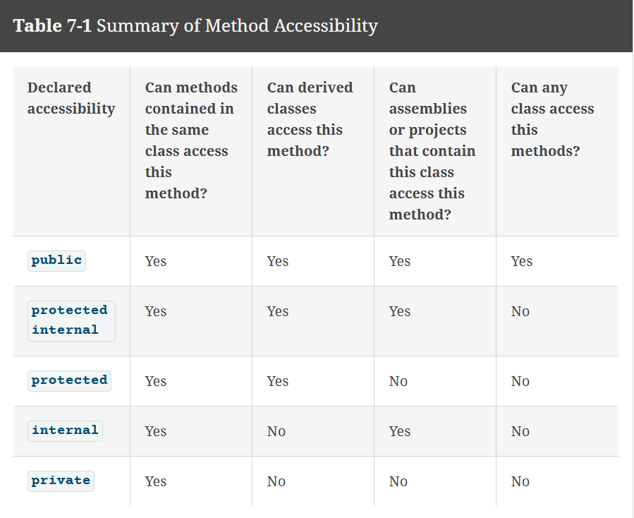

---

# Chapter 7 — Using Methods

> drop your screenshots into an `images/` folder to light up the figure links.

## Table of Contents

* [Understanding Methods and Implementation Hiding](#understanding-methods-and-implementation-hiding) (p.264–267)
* [Writing Methods with No Parameters and No Return Value](#writing-methods-with-no-parameters-and-no-return-value) (p.268–276)

  * [An Introduction to Accessibility](#an-introduction-to-accessibility) (p.269–270)
  * [An Introduction to the Optional `static` Modifier](#an-introduction-to-the-optional-static-modifier) (p.271)
  * [An Introduction to Return Types](#an-introduction-to-return-types) (p.271)
  * [Understanding the Method Identifier](#understanding-the-method-identifier) (p.272)
  * [Placing a Method in a Class](#placing-a-method-in-a-class) (p.272–273)
  * [Declaring Variables and Constants in a Method](#declaring-variables-and-constants-in-a-method) (p.274)
  * [You Do It — Calling a Method](#you-do-it--calling-a-method) (p.275–276)
* [Writing Methods That Require a Single Argument](#writing-methods-that-require-a-single-argument) (p.277–280)
* [Writing Methods That Require Multiple Arguments](#writing-methods-that-require-multiple-arguments) (p.281–282)
* [Writing Methods That Return a Value](#writing-methods-that-return-a-value) (p.283–286)

  * [Writing a Method That Returns a Boolean Value](#writing-a-method-that-returns-a-boolean-value) (p.285)
  * [Analyzing a Built-In Method](#analyzing-a-built-in-method) (p.286)
* [Passing Array Values to a Method](#passing-array-values-to-a-method) (p.289–293)

  * [Passing a Single Array Element](#passing-a-single-array-element) (p.289–290)
  * [Passing an Entire Array (incl. multi/jagged)](#passing-an-entire-array-incl-multijagged) (p.291–292)
* [Alternate Ways to Write a `Main()` Method Header](#alternate-ways-to-write-a-main-method-header) (p.293–294)

  * [`Main(string[] args)`](#mainstring-args)
  * [`static int Main(...)`](#static-int-main)
  * [`public` access for `Main`](#public-access-for-main)
* [Issues Using Methods in GUI Programs](#issues-using-methods-in-gui-programs) (p.295–297)

  * [Auto-Generated Event Methods](#auto-generated-event-methods)
  * [Scope in a GUI Program](#scope-in-a-gui-program)
  * [Nonstatic Methods on a `Form`](#nonstatic-methods-on-a-form)
* [Chapter Summary](#chapter-summary) (p.298)
* [Key Terms](#key-terms) (p.299)
* [Review Questions](#review-questions) (p.299)
* [Syntax Tracker](#syntax-tracker)
* [Program Checklist](#program-checklist)
* [Common Pitfalls](#common-pitfalls)
* [Error Fix Notes](#error-fix-notes)
* [Mini Syntax Cheat Card](#mini-syntax-cheat-card)

---

## Understanding Methods and Implementation Hiding

A **method** is an encapsulated set of statements that performs a task. Programs invoke methods by name; the internal steps are hidden (implementation hiding/“black box”).

**Syntax inventory (new):** `method`, *calling method*, *called method*, **implementation hiding**

**HelloClass:**

```csharp
using static System.Console;

class HelloClass
{
    static void Main()
    {
        WriteLine("Hello");   // calling WriteLine() (a called method)
    }
}
```


**Figures:**


[Back to TOC](#table-of-contents)

---

## Writing Methods with No Parameters and No Return Value

Create reusable methods instead of repeating statements — reduces **`code bloat`** and `improves clarity`.

A method **must** include:
- A `method declaration` is also known as a `method header` or `method definition`.

- open `{`

- A `method body`, which is a block of statements that carry out the method's work. the functionality, if you will.

- closing `}`

```cs
private static void ShowWelcomeMessage()
{
    Writeline("Welcome");
    Writeline("Have fun!");
    Writeline("Enjoy the program!");
}
```


### An Introduction to Accessibility

The optional declared accessibility for a methos sets limits as to how other methodscan use your method; accessibility can be any of the levels described in Table 7-1. The most common ones you will use is `public and private`.

* If no access modifier is written, **methods are `private` by default**.
* `public` methods can be called from other classes/assemblies.
* Typical classroom console examples keep methods `private` unless designed for reuse.



> _Quick rule_: IF the method does not need INPUT data, you still need the `()` at the end.

In chapter 1, we learn that we could use the fully qualifies method call `System.Console.WriteLine()` to use the method. if you include the namespace with `using` at the top of a program, then you do not have to go use the full qualified method call.

Since you can call it using the Console class method, it tells us that it is `NOT Private`

#### GUI
> Whehn creating GUI apps, we learned how automaticall generate the `Click()` method for a button. In this case, we would want to spcify this as a private method, jsut becauase you would have no reason for that button's functionality to work somewhere else. It is just not logical

Later, we will learn how to know when to use them appropriately. 

[Back to parent](#writing-methods-with-no-parameters-and-no-return-value) • [Back to TOC](#table-of-contents)


### An Introduction to the Optional `static` Modifier

* `static` methods are called **on the class**, not on an object.
* In early chapters we use `static` exclusively (no objects yet).

**Call pattern examples (same class):**

```csharp
// Static method inside same class: no qualifier needed
Methods();

// Static method in other class: ClassName.Method()
PayrollApplication.DeductUnionDues();
```
> Do not confuse this with the public accessiblity keyword. public is about who can use it. While static is about how the method can be used; Directly from the class OR storing it in an object/variable.

`static` → shared data, lives once, class-level scope
> “You use static when the method’s behavior doesn’t rely on a specific instance, whether it’s called from inside or outside the class.”

`non-static` → unique data, per object, instance-level scope

[more on static](static.md)


[Back to parent](#writing-methods-with-no-parameters-and-no-return-value) • [Back to TOC](#table-of-contents)


### An Introduction to Return Types

Every method has a `return-type` indicating what kind of value the method will return to any other method that calls it. If a method does not return a value, its return type is `void`. A methods return type is known more succinctly as a `methods type`. Later in the chapter you will create methods with return types such as `int` or `double` that returns values of the corresponding type. Such methods can be called `value-returning methods`.


 For now the methods discussed are void methods that do not return to value.

 When the methods of turn type is void, most C programmers do not end the method with a return statement. However, you can and avoid method with the following statement that indicates nothing is returned.

 ```cs
 return;
 ```

* `void` → returns nothing; `return;` optional.
* Any type allowed (built-in or class type).

```csharp
void PrintBanner() 
{ 
    Console.WriteLine("=== Go! ==="); 
}

int Add(int a, int b) 
{ 
    return a + b; 
}  // must return an int
```

[Back to parent](#writing-methods-with-no-parameters-and-no-return-value) • [Back to TOC](#table-of-contents)


### Understanding the Method Identifier

Every method has a name that must be a legal C# identifier. That is, it must not contain spaces and must begin with the letter of the alphabet or an _ By convention, many programmers start method names with verb because methods cause actions. Examples of conventional method names include `DeductTax()` and `DisplayNetPay()`

Every method name is followed by a set of parentheses. Sometimes these parentheses contain parameters, but in the simplest methods the parentheses are empty. A `parameter to a method` is a variable that **holds state of path to a method** when it is called. The terms `arguments` and `parameter` are closely related. An **argument is data in a method call**, and a **parameter is in the method header**. It receives an argument's value when the method executes.

The parentheses that follow a method name in its header can **hold one parameter or multiple parameters** separated with commas. The contents within the parentheses are known as the `parameter list`.

* Legal C# identifier; parentheses always follow the name.
* **Parameter** (in header) receives an **argument** (at call site).

```csharp
void DisplayNetPay(parameter) 
```

[Back to parent](#writing-methods-with-no-parameters-and-no-return-value) • [Back to TOC](#table-of-contents)


### Placing a Method in a Class

In summary, the first methods to writing console applications will be `private`, `static` and `void`, and **will have empty parameter lists**. 
- They won't be called from `other classes`
- They won't require an `object reference`
- They will `not return any value` to their calling method
- They will `not accept any data` from the outside.

By convention, programmers indent the statements in a method body, which makes the method header and its braces stand out. When you write a method using the Visual Studio editor, the method statements are indented for you automatically. You can place as many statements as you want within the method body.

 `Methods cannot overlap`, and usually you want to place methods one after the other within a class. The order the methods appear in the class is not important. It is **only importatnt the the order in which they are called** that affects how they execute.

 In the early versions of C sharp, you could not replace a method within another method. However, starting with C# 7.0, you can. When the method resides entirely within another method, it is known as a `local function`. And they can be called only from its containing method and not from any other methods. (Some special rules are in place for `local functions. For example, they cannot be static`, and they `do not use an accessibility modifier`. So the rest of the methods used in this book will not be local functions.)

 To make the `Main()` method call the `ShowWelcomeMessage()` method, you simply use the `ShowWelcomeMessage()` method's name as a statement within the body of the `Main()` method. 


```csharp
//Figure 7.3
using static System.Console;

class HelloClass
{
    static void Main()
    {
        ShowWelcomeMessage();   // call custom method
        WriteLine("Hello");
    }

    private static void ShowWelcomeMessage()
    {
        // method body – three WriteLine() calls
        WriteLine("Welcome.");
        WriteLine("Have fun!");
        WriteLine("Enjoy the program!");
    }
}
```


**Expected output**

```
Welcome.
Have fun!
Enjoy the program!
Hello
```

[Back to parent](#writing-methods-with-no-parameters-and-no-return-value) • [Back to TOC](#table-of-contents)


### Declaring Variables and Constants in a Method

You can write any statements you need within the method, including variable and constant declarations. In _chapter 5_ you learn that the term to describe the area of a program in which a variable or named constant is called **scope**. 

Variables and constants that are declared within the method are in scope only from the point at which they are declared to the end of the method. 

Programmers also say that the area in which an item can be used is the area in which it is `visible`. Programmers also say that the variable is a `local variable`. A locally-declared variable is **not** known to other methods or usable in them and if another method contains a variable within the same name, **the two variables are completely distinct.**

Local scope begins at declaration and ends at method close brace.

```csharp
//Figure 7.5
using static System.Console;

class LocalVariableDemo
{
    static void Main()
    {
        int a = 12;
        WriteLine("In Main() a is {0}", a);
        MethodWithItsOwnA();                  // local a below is unrelated
        WriteLine("In Main() a is {0}", a);
    }

    private static void MethodWithItsOwnA()
    {
        int a = 354;                          // local to this method only
        WriteLine("In method a is {0}", a);
    }
}
```


**Output (what you should see)**

```
In Main() a is 12
In method a is 354
In Main() a is 12
```

[Back to parent](#writing-methods-with-no-parameters-and-no-return-value) • [Back to TOC](#table-of-contents)

### You Do It — Calling a Method

```csharp
using static System.Console;

class DemoLogo
{
    static void Main()
    {
        Write("Our company is ");
        DisplayCompanyLogo();                 // prints 2 lines
    }

    private static void DisplayCompanyLogo()
    {
        WriteLine("See Sharp Optical");
        WriteLine("We prize your eyes");
    }
}
```


> If you remove `static` from `DisplayCompanyLogo`, calls from `Main` will fail (`CS0120`). Re-add `static` or create an instance.

[Back to parent](#writing-methods-with-no-parameters-and-no-return-value) • [Back to TOC](#table-of-contents)

---


## Writing Methods That Require a Single Argument

Some methods require additional information. If a method could not receive arguments, then you would have to write an infinite number of methods to cover every possible situation. For example, when you make a dental appointment, you do not need to employ a different method for every date of the year at every possible time of the day. Rather, you can supply the date and time as information to the method, and no matter what date and time you supply, the method is carried out correctly.

 If you design a method to compute an employee's paycheck, it makes sense that you write a method named compute paycheck and supply it with an hourly pay rate, rather than having to develop methods with names like `ComputePaycheckAt14AnHour`(), or `ComputePaycheckAt15AnHour`(), and so on. 

 You already have used methods to which you supply a wide variety of parameters. At any call the `WriteLine()` method can receive any one of infinite number of strings as a parameter-- "`Hello`", "`Goodbye`" and so on. 

When you write the declaration for a method that accepts a parameter, you need to include the following items within the method declaration parentheses:

- The `data type` of the parameter
- A local indentifier (`name`) for the parameter

For example, consider a method named `DisplaySalesTax()`, Which compute and displays a tax as 7% of a selling price. The method header for usable `DisplaySalesTax()` method could be the following:


```cs
static void DisplaySalesTax(double saleAmount)
```

You can think of the parentheses in the method declaration as a funnel into the method.` Data parameters listed there, are dropping in to the method`.

The parameter `double` saleAmount within () indicates that the DisplaySalesTax() method will receive a value type `double`. Within the method, the value will be known as `saleAmount`. **Figure 7-9**

Declare type + local parameter name in the header.

```csharp
//Figure 7-9
// DisplaySalesTax(): computes and prints 7% tax on an amount
private static void DisplaySalesTax(double saleAmount)
{
    const double RATE = 0.07;
    double tax = saleAmount * RATE;
    Console.WriteLine("The tax on {0} is {1}",
        saleAmount.ToString("C"), tax.ToString("C"));
}

```
Remember from chapter 2, using the fixed format with no number defaults to two decimal places.

The example above is using a void return type because `you do not need it to return any value` to any method that uses it. Its only function is to receive the amount multiplied by the 7% and then display the results. By creating a static method, you `do not want the main method to be required to create an object` with which to use it. You want the static `Main()` method to be able to call the method directly.

Within the program. You can call the `displaySalesTax` method by using the method's name and within parentheses an argument that is either a **constant** value or a **variable**. Assuming that my purchase is declared double. Both of the following calls to the `displaySalesTax` method invok it correctly.

**Sample calls**

```csharp
double myPurchase = 12.99;
DisplaySalesTax(myPurchase);  // variable argument
DisplaySalesTax(35.67);       // constant argument
```

#### identifier is the parameter; Holds a state

You can call the method any number of times, with a different constant or variable argument each time. The value of these arguments becomes known as `sellAmount` within the method. Interestingly, if the argument in the method of call is a variable, it might possess the same identifier as the one that you passed on to the identifier for the method. The identifier is simply the name. The value "_goes by_" while being used within the method, no matter what name it uses in the calling program. 

That is, the identifier is a `local variable` to the `displaySalesTax` method. As are any variables and constants declared within a method.

The variable saleAmount declared in the method header is an example of a `formal parameter`, a prameter within a method header that accepts a value. In contrast, arguments within a method call often is referred as `actual parameter`. 

For example in the cmethod calling statement `DisplaySalesTax(myPurchase);`, `myPurchase` is an actual aprameter.

The formal parameter is an example of a value parameter or a parameter that receives a copy of the value passed to it. We will learn more about value parameters and other types of parameters in the next chapter.

The `DisplaySalesTax()` method employs `implementation hiding`. That is, if a programmer changes the way in which the tax value is calculated, for example by coding one of the following programs that use the The DisplaySalesTax() , method will not be affected and will not need to be modified.
 ```cs
 tax = saleAmount * 7 / 100;
 tax = 0.07 * saleAmount;
 tax = RATE * saleAmount; 
```
No matter how the text is calculated, a calling program passes a value into the DisplaySalesTax() method, and a calculated result appears on the screen twice.

```cs
// Figure 7-10
using static System.Console;
class UseTaxMethod
{
    static void Main()
    {
        double myPurchase = 12.99;
        DisplaySalesTax(myPurchase);
        DisplaySalesTax(35.67);
    }
    private static void DisplaySalesTax(double saleAmount)
    {
        double tax;
        const double RATE = 0.07;
        tax = saleAmount * RATE;
        WriteLine("The tax on {0} is {1}", saleAmount.ToString("C"), tax.TOString("C"));
    }
}

```
An argument type in a method call can match the method's parameter type exactly, but it can use a different data type if the argument can be converted automatically to the parameter type. Recall from chapter two that C# supports the following automatic conversions:


- From `byte` to `short`, `ushort`, `int`, `uint`, `long`, `ulong` `float`, `double` or `decimal`.

- From `short` to `int`, `long`, `float`, `double` or `decimal`.

- From `ushort` to `int`, `uint`, `long`, `ulong`, `float`, `double`, or `decimal`

- From `int` to `long`, `float`, `double`, or `decimal`

- From `uint` to `long`, `ulong`, `float`, `double`, or `decimal`

- From `long` to `float`, `double`, or `decimal`

- From `ulong` to `float`, `double`, or `decimal`

- From `char` to `ushort`, `int`, `uint`, `long`, `ulong`, `float`, `double`, or `decimal`

- From `float` to `double`

Now that we have seen how to write methods that accept the arguments, you might guess that when you write `WriteLine("Hello")`, the header for the called methods is similar to `public static void WriteLine("string s")`. You might not know the perimeter name the creators of C Sharp have chosen, but you do know the method's `return type`, `name` and `parameter type`.

This is very useful for when you are: 
1. designing a program in stages

2. You're working in teams and need to agree on interfaces before implementation.

3. You're writing stub methods for testing in scaffolding.

[Back to TOC](#table-of-contents)

---


## Writing Methods That Require Multiple Arguments

Order matters; types must match or be implicitly convertible.

```csharp
private static void DisplaySalesTax(double saleAmount, double taxRate)
{
    double tax = saleAmount * taxRate;
    Console.WriteLine("The tax on {0} at {1} is {2}",
        saleAmount.ToString("C"), taxRate.ToString("P"),
        tax.ToString("C"));
}
```


**Wrong order demo**
`DisplaySalesTax(0.10, 200.00); // computes but reads wrong — arguments swapped`

[Back to TOC](#table-of-contents)

---


## Writing Methods That Return a Value
When you call a method like `Console.ReadLine()`, the type of value it returns is already defined by that method. In this case, `ReadLine()` always returns a string, no matter what the user types. So when you assign its result to a variable, that variable must also be a string. You’re essentially “inheriting” the return type from the method you’re calling—meaning your code has to match what the method gives back.

if you wanted to create a method that accepts the hours of an employee worked and the hourly pay rate, and to return a calculated gross pay value:

Return a result to the caller.


```csharp
private static double CalcPay(double hours, double rate) //
{
    double gross = hours * rate;
    return gross; // last statement returns to the calling method
}
```
notice the method header! : the return types set in the header must match the methods return statement. Or it will not compile.


**Use it**
If a method returns a value. And you call the method, you **typically want to use the return value**, although you're not required to use it.
For example, when you invoke the `CalcPay()` method, you might want to assign the value to a double variable named grossPay as in Figure-17
```cs
grossPay = CalcPay(myHours, myRate)
```

`CalcPay()` return a `double` variable, so it would only be appropriate to also use a double.
```cs
using static System.Console:
class UseCalcPay
{
    static void Main()
    {
        double myHours = 37.5;
        double myRate = 12.75;
        double grossPay; // we declare the same double as the expected return value.
        grossPay = CalcPay(myHours, myRate);
        WriteLine("I worked {0} hours at {1} per hour", myHours, myRate);
        WriteLine("My gross pay is {0}", grossPay.ToString("C"));
    }
    Private static double CalcPay(double hours, double rate);
    {
        double gross;
        gross = hours * rate;
        return gross;
    }
}
```
Instead of storing a methods returned value in a variable, you can use it directly, as in statements that produce output or perform arithmetic such as the following


```csharp
WriteLine("My gross pay is {0}", CalcPay(myHours, myRate).ToString("C"));
double tax = CalcPay(myHours, myRate) * TAX_RATE;

/*
In the first statement, the call to the CalcPAy() methos is made within the WriteLine() method call.
IN the second, CalcPay()'s returned value is used in an arithmetic statement.

Because CalcPay returns a double, you can use the method call CalcPay() in the same way you would use 
any double value.

The method CalcPay() has a double data type in the same way a double variable does.
*/
```

As an additional example, suppose that you have a method named `GetPrice()` that accewpts an item number and returns its price.
The head woould read as follows:
```cs
private static double GetPrice(int itemNumber) // expected input is an int (item number) and expected output as a double (price).

```
Further suppose that you want to **ask the user to enter an item number** from the keyboard so you can pass it the the `GetPrice` method. You can `get the value from the user`, `store it in a string`, `convert the string to an integer`, `pass the integer to the `GetPrice()` method`, and `store the returned value in a variable named `price`` in four or five seperate statement.
Or you could do this:
```cs
price = GetPrice(Convert.ToInt32(ReadLine())); // Instead of 5 lines of code, we can do it in one. 
```

This statemet above contains the readline `ReadLIne()` method within a method call to conver to an int, within a method call `GetPice()`. Then methods are inside other method calls it is called `nested method calls`. Then you write 3 nested statements, the innermost method is executed first.

Its return value is then used as an argument to the intermediate method, and its return value is used as an argument ot the outer method. 

There is no limit!

The system keeps track of where to return after a method call in an area of memory called `stack`. Another area of memory called the `heap` is where `memory can be allocated` while a program is executing.


[Back to TOC](#table-of-contents) • [Back to parent](#writing-methods-that-return-a-value)


### Writing a Method That Returns a Boolean Value

Use the returned `bool` anywhere a Boolean expression is valid.

When a method return a bool type, the method can  be used anywhere you can use a Boolean expression. 
For example, suppose that you have written a method called `isPreferreCustomer()` that returns a bool value indicatinf if a customer is a preferred customerwho qualifies for a discount. You can write an if statement:
```cs
if(isPreferreCustomer())
    price = price * DISCOUNT;

```

In `Chapter 4` we learnewd about side efferct and how they affect compund Boolean expressions. You `must` be careful not to `cause` unintended side effects. For example imagine you are trying to use the if statement where the intention is to set a delivery fee of `0` if both the `isPreferreCustomer()` and the isLocalCustomer() mehods return True

```cs
if(isPreferreCustomer() and isLocalCustomer())
    delivery = 0;
```

If the `isLocalCustomer()` method should be performed some desired task -- for example, displaying a message about the customer's status or applying a local customer discount to the price -- then you might not achieve the desired result. This is because of `short-circuit evaluation`.

If the `isPreferreCustomer()` method return `false`, the `isLocalCustomer()` method never executes. If that is your intention, then it is fine, but always consider any `unintended` side effects.


*Short-circuit caution*: in `if (IsPreferredCustomer() && IsLocalCustomer())`,
if the first returns `false`, the second is never evaluated — avoid side effects in such methods.

[Back to parent](#writing-methods-that-return-a-value) • [Back to TOC](#table-of-contents)


### Analyzing a Built-In Method

C# privides you with many prewritten methods such as WriteLine() and ReadLine().

In `Chapter 2`, we learned about C# arithmetic operatos such as `+` and `*`, and we learned that C# provides no exponential operator. Instead, to raise a number to a power, you can use the built-in `Pow()` method. For example, to raise to the third power `(2*2*2)` and store the answer in the variable result, you can write a progeam that includes the following:

```csharp
double result = Math.Pow(2.0, 3.0); // class Math, static Pow, returns double
```
From this statement, you know the following about the `Pow()` method:
1. It is in the `Math class` because the class name and a dot precede the method call.
2. It is `public` because you can write a program that uses it.
3. It is `static` because it is used with its class name and a dot, without any object.
4. It accepts 2 `double` parameters.
5. It `return a double` or `a type that can be promoted automatically to a double (such as an int)` because ots answer is stored in a double.

Although you might know many facts about the `Pow()` method, you do not know how its instructions are carried out internally. In good object-oriented style, its implementation is hiddden.


* class-qualified call (`Math.`) ⇒ static method
* two `double` parameters ⇒ `Pow(double, double)`
* returns `double`

[Back to parent](#writing-methods-that-return-a-value) • [Back to TOC](#table-of-contents)


```cs
using static System.Console;
class PhoneCall
{
    private static double CalcPhoneCallPrice(int minutes, double rate) // static because it will be called by a static Main() method without creating an object
    {
        const double BASE_FEE = 0.25;
        double callFee;
        callFee = BASE_FEE + minutes * rate;
        return callFee;
    }

    static voin Main()
    {
        int[] callLengths = {2, 5};
        double[] rates = {0.03, 0.12};
        double priceOfCall;
        WriteLine({0, 10},{1, 10},{2, 10}, "Minutes", "Rate", "Price");

        for(int x = 0; x < callLengths.Length; ++x)
            for(int y = 0; y < rates.Length; ++x)
            {
                priceOfCall = CalcPhoneCallPrice(callLengths[x], rates[y]);
                WriteLine("{0, 10}, {1, 10}, {2, 10}", callLengths[x], reates[x], priceOfCall.ToString("C"));
            }
    }

}
```


---

## Passing Array Values to a Method


passing `an array element` to a method **and** passing `an array` to a method require different approaches.


### Passing a Single Array Element
(Passing a Single Array Element to a Method)

In the chapter `Using Arrays`, we learned that you can declare an array to create a list of elements, and that can use any individual array element in the same manner as you wouls use a single variable of the same type. That is, you declare an integer array as follows:
```cs
int[] someNums = new int[12];
```

You can sensequently output `someNums[0]` or add 1 to `someNums[1]`, just as you would for integer. Similarily, you can pass a single array element to a method in exactly the same manner as you would pass a variable.

Consider the program shown in `Figure 7-17`. This program creates and uses an array of four integer.

```cs
// Figure 7-17

using static System.Console;
class PassArrayElement
{
    static void Main()
    {
        int[] someNums = {10, 12, 22, 35};
        int x;
        Write("\nAt beginning of Main() method...");

        for(x = 0; x < someNums.Length; ++x)
            Write("{0, 6}", someNums[x]);
        WriteLine();

        for(x = 0; x < someNnums.Length; ++x)
            MethodGetsOneInt(someNums[x]);
        Write("At end of Main() method..........");

        for("x = 0; x < someNums.Length; ++x")
            Write("{0, 6}", someNums[x]);
    }
    private static void MethodGetsOneInt(int oneVal)
    {
        Write("In MethodGetsOneInt() {0}", oneVal);
        oneVal = 999;
        WriteLine("     After change {0}", oneVal);
    }
}
```
[Figure 7-17 OUTPUT](images/7.18Output.png)

As you can see in the output, the program displays the four original values, then passes each to the MethodGetsONeInt() method, where is is displayed and then changed to 999.

After the method executes four times, the `Main()` method displays the four values again, showing that they are `unchanged` by the assignments within the `MethodGetsONeInt()`. The oneVal variable is local to the `MethodGetsONeInt()` method; therefore, any changes to variables passed into the method are not permanent and are not reflected in the array declared in the `Main()`program. Each timee the `MethodGetsONeInt()` method executes, its `oneVal` variable exists only while the `MethodGetsONeInt()` method is executing.


```cs
// My own words
/*We start by creating an array called someNums with four integer values: {10, 12, 22, 35}. Then we declare an int variable x, which serves as the loop counter.

The program first prints the message "At beginning of Main() method...". It then enters a for loop that iterates through each element of the array. Inside the loop, it uses Write("{0,6}", someNums[x]) to print each value with a minimum width of 6 characters, creating evenly spaced output. After the loop, a WriteLine() adds a newline.

Next, the program enters a second for loop, again iterating through the array. This time, each element is passed as an argument to the method MethodGetsOneInt(). This method must be defined within the same class to be accessible. It’s marked private (accessible only within the class), static (so it can be called without creating an object), and void (because it doesn’t return a value).

The method takes one parameter: int oneVal. This parameter must match the type of the argument being passed—in this case, an int. Inside the method, oneVal is printed, then reassigned to 999, and printed again. However, this change only affects the local copy of the value. Because primitive types like int are passed by value, the original array remains unchanged.

Finally, the program runs a third loop, printing the message "At end of Main() method..." and displaying the array again. The output confirms that the original values are intact, demonstrating that changes made inside MethodGetsOneInt() do not affect the original array.

This example teaches several key concepts:

Pass-by-value: Primitive types are passed as copies, so changes inside the method don’t affect the original data.

Method scope: Local variables like oneVal exist only during method execution.

Type matching: Method parameters must match the type of the arguments passed.

Method reuse: You can call a method multiple times within a loop, each time with a different argument.

[Back to parent](#passing-array-values-to-a-method) • [Back to TOC](#table-of-contents)
*/
```


### Passing an Entire Array (incl. multi/jagged)
(Passing an Array to a Method)

Instead of passing a single array element to a method, you can pass an entire array. You indicate that a method parameter must be an array by placing square brackets after the data type in the method's parameter list. When you pass an array to a method, changes you make to array elements within the method are reflected in the original array that was sent to the method. A memory address is also known as a `reference`. Arrays, like all objects but unlike built-in types such as **double** and **int**, are `passed by reference`. Tha is, when a simple built-in type is passed to a method, it is `passed by value`. That is, the method receives a copy of the value at a new memory address. However, when in a race passed to a method, the method receives the actual memory address of the array and has access to the actual values in the array elements. You already have seen the methods that can alter arrays passed to them. When you use the `Sort()` and `reverse()` methods in `chapter 6`, you saw that the methods changed their array parameter contents.

The program shown in Figure 7-19 creates an array  of four integers. After the integers are displayed, the entire array is passed to a method named `MethodGetsArray()` in the shaded statement. Within the method header, the parameter is declared as an array by using square brackets after the parameter data type. Within the method, the numbers are outputs which shows that they retain their values from Main() upon entering the method, but when the value 888 is assigned to each number. Even though `MethodGetsArray()` is a `void` method (meaning that nothing is returned to the Main() method), when the program displays the array for the second time within the Main() method, all of the values have been changed to 888, as you can see in Figure 7-20. Because arrays are passed by reference, the `MethodGetsArray()` method "knows" the address of the array declared in Main() and makes it changes directly to the original array declared in Main() and makes its changes directly to the original array that was declared in the Main() 


```cs
// Figure 7-19
using staic System.Console;
class PassEntireArray
{
    static void Main()
    {
        int[] someNums = {10, 12, 22, 35};
        int x;
        Write("\nAt beginnning of Main() method...");
        for(x = 0; x < someNums[x]; ++x)
            Write("{0, 6}", someNums[x]);
        WriteLine();

        MethodGetsArray(someNums); // Here we are passing the array
        Write("At end of Main() method...........");
        for(x = 0; x < someNums[x]; ++x)
            Write("{0, 6}", someNums[x]);
    }
    private static void methodGetsArray(int[] vals)
    {
        int x;
        Write("In MethodGetsArray() ");
        for(x = 0; x < vals.Length; ++x)
            Write(" {0}", vals[x]);
        WriteLine()
        for(x = 0; x < vals.Length; ++x)
            vals[x] = 888;
        Write("After Change");
        for(x = 0; x < vals.Length; ++x)
            Write(" {0}", vals[x]);
        WriteLine();

    }

}
```
Notice that you do not insert a number within the square brackets of the array definition in the method parameter list. Inserting a number causes a compiler error. It makes sense that the brackets are empty because a method that receives an array gets its starting address, not a number of elements.

 You can create and pass an unnamed array to a method in a single step. For example, you can write the following:

 ```cs
MethodThatAcceptsArray(new int[] {45, 67, 89}); // creating and passing an unnamed array to a method
 ```

 You can pass a multi dimensional array to a method by indicating the appropriate number of dimensions after the data type the method header. For example, the following method header accepts two dimensional arrays of `int` and `double`s, respectively.

 ```cs
private static void displayScores(int[,] scoresArray) //multidimensional
```
```cs
private static bool areAllPricesHigh(double[,] prices)
 ```

 With jagged arrays, you can insert the appropriate number of square brackets after the data type in the method header. For example, the following method headers accept jagged arrays of `int` and `double` respectively.
 ```cs
private static void displayIDs(int[][] idArrays)
 ```

  ```cs
private static double computeTotal(double[][] prices)
 ```

 With methods that accept multi-dimensional arrays as parameters. Notice that the brackets that define the array in each method header are empty. Like any other array pass to a method. Inserting numbers into the brackets for a jagged array is not necessary because each passed array name is a starting memory address. The way you manipulate subscripts within the method determines how rows and columns are accessed.

 The size of each dimennsion of a multidimensional array can be accessed using the `GetLength()` method. For example, `scoresArray.GetLength(0)` return the value of the first dimension of `scoresArray`


Arrays are **passed by reference** (the method receives the memory address).
`even if a method is void` when passing an array to another method, any changes made with the void method `will still reflect any changes` back into the Main() method where the array is found. This is because the original array was `altered` by the method, which had the `array's memory location` at the time of execution.


[Back to parent](#passing-array-values-to-a-method) • [Back to TOC](#table-of-contents)

---


## Alternate Ways to Write a `Main()` Method Header

Throught this book, you have written Main() methods with the following header:
```cs
static void Main()
```

Using the return type void and listing nothingg between the parenthesis that follow `Main` is just one way to write a Main() method header in a program. However, it is the first way listed in the C# documentation, and it is convention used in this book. This section describes alternatives because you might see different `Main()` method headers in other books or in programs written by others.

Another way:
```cs
static void Main(string[] args)
```

### `Main(string[] args)`
(Writting a Main() Method with a Parameter List):

The phrase `string[] args` is a parameter to the Main() method. 

The variable `args` represents **an array of strings** that you pass to `Main()`.Although you can use **any** identifier, `args` is conventional. In particular, Java programmers might prefer the C# version of Main() that includes the `string[] args` parameter because their convention is to write main methods with the same parameter. 

use this format for the `Main()` method header if you need to access command-line arguments passed in to your application. For example, the program in Figure 7-21 displays an `args` array that is a parameter to its `Main()` method. Figure 7-22 shows how a program might be executed from the command-line using arguments to the `Main()`.

### Why this is useful:

- you can pass dynamic input without hardcoding values

- Build flexible tools that behave differently based on input

- Automate tasks using scripts or batch files.


Read command-line arguments.

```csharp
// Figure 7-21

using static System.Console;

class DisplayArgs
{
    static void Main(string[] args)
    {
        for (int x = 0; x < args.Length; ++x)
            WriteLine("Argument {0} is {1}", x, args[x]);
    }
}
```
### My explanation of `string[]` and `args`

We begin by including the `System.Console` namespace, which gives us access to methods like `WriteLine()` and `ReadLine()` for console input and output.

Next, we define a class called `DisplayArgs`. Inside this class, we declare the `Main()` method with a parameter: `string[] args`. This parameter allows the program to receive command-line arguments when it’s launched. Each space-separated value passed at runtime is stored as a string in the `args` array.

Inside `Main()`, we use a `for` loop to iterate through the `args` array. We initialize a counter variable `x` to 0, and continue looping while `x` is less than `args.Length`. With each iteration, we increment `x` using `x++` to move through the array.

During each iteration, we use `WriteLine()` to output a formatted string. The format string `{0}` represents the current index (`x`), and `{1}` represents the value stored at that index (`args[x]`). This results in a clean display of each command-line argument alongside its index.

This example demonstrates several key concepts:
1. **Command-line input**: `string[] args` captures user-provided input at launch.
2. **Array iteration**: The loop processes each argument in order.
3. **String formatting**: `{0}` and `{1}` allow us to display both index and value.
4. **Type consistency**: All values in `args` are strings, even if they look like numbers.

---

If you ran the program with:
```bash
DisplayArgs.exe Houston 25 Israel
```

You’d get:
```
0 Houston  
1 25  
2 Israel
```

> Even if you do not need access to command-line arguments, you can still use the version of the Main() method header that references them. 


[Back to parent](#alternate-ways-to-write-a-main-method-header) • [Back to TOC](#table-of-contents)


### `static int Main(...)`
**(Writting a Main() method with an Integer Return Type)**


Some programmer prefer to write main() method headers that have a return type of `int` instead of `void`. If you use this form, the last statement in the `Main()` method `must be a return statement` that return an ``. By convention, a return value of 0 means that an application ended with without error. 

The value might be used by your OS or another program that uses your program. In particular, C# programmers might prefer the version of `Main()` thata return an int since conventionally they write their main methods with an int return type.

Return `0` for success (convention used by some environments).

```csharp
static int Main(string[] args)
{
    // ... do work
    return 0; // success
}
```
[Back to parent](#alternate-ways-to-write-a-main-method-header) • [Back to TOC](#table-of-contents)


### `public` access for `Main`
**(Writting Main() Method with Public Access)**

Some programmers prefer to write `Main()` methods with `public` access rather than `private`; Which is the default access when no identifier is listed. in particular, JAVA programmers might prefer to use ``public`` because the style is conventional for them. If the class `Main()` method is `public`, it can be called from another class by using a fully qualified name. Because you rarely want to do this, C# programmers often omit the `Main()` method's access specifier, amking it `private` by deafult.

Some ecosystems prefer `public static void Main(...)`.
C# defaults to `private` when omitted.

[Back to parent](#alternate-ways-to-write-a-main-method-header) • [Back to TOC](#table-of-contents)

---


## Issues Using Methods in GUI Programs

You can call methods from other methods in a GUI application in the same way you can in a console application. Some special considerations when creating GUI application include:

- understanding methods that are automatically generated in the visual environment

- Appreciating scope in a GUI

- Creating methods to be nonstatic when associated with a `Form`

### Auto-Generated Event Methods

When you create GUI appplications using the IDE, many methods are generated automatically.

For example, when you place a Button named okButton on a Form in the IDE and double-click it, a method is generated with the following header:

```cs
private void okButton_Click(object sender, EventArgs e)
```

The method is `private`, which means it can be used only within its class, and it is `void`, meaning it does not return value. You could change the access specifier to `public` and the methods still would work, but usually you would have no reason to make such a change. If you change the return type (`void`), the program will not compile.

The format of the method name `okButton_Click()`is conventionally for event-handling methods that are created automatically. The name includes the **control name**, an **underscore**, and the **event that causes the method to execute**--in this case, a `Click` event. Because the C# convention is to begin method names with an uppercase letter, you usually want to change the automatically generated-method names as you saw in `Chapter 3`. 

For example, you might change `okButton_Click()` to OkButton_Click().

The parameters by `Click()` method **arrive automatically** when a user clicks the corresponding `Button`. The parameter `sender` is the objects that generates the event that caused the method to execute, and the parameter `e` contains information about the type of event. Figure 7-23 shows a ``Click()` method in a GUI application that displays the ToString() values of these 2 parameters.


Visual designer generates handlers such as:

```csharp
// Figure 7-23

private void okButton_Click(object sender, EventArgs e)
{
    label1.Text = "object sender is: " + sender.ToString();
    label2.Text = "EventArgs e is: " + e.ToString();
}
```

 

### Scope in a GUI Program

Variables needed across multiple handlers should be **fields** (declared in the `Form` class, not inside a handler).

### Nonstatic Methods on a `Form`

Handlers are nonstatic because they’re associated with a `Form` *instance*.

[Back to TOC](#table-of-contents)

---

## Chapter Summary

* Methods encapsulate work; OOP hides implementation details.
* Method header: `[access] [static] returnType Name([parameter list])`.
* Arguments must match the declared parameters (allowing numeric promotions).
* `void` returns nothing; otherwise a `return value;` is required.
* Passing arrays gives the callee access to the caller’s elements.
* `Main` variants: `Main()`, `Main(string[] args)`, `public`/`private`, `int Main`.
* GUI: event handlers are nonstatic, receive `object sender, EventArgs e`.

[Back to TOC](#table-of-contents)

---

## Key Terms

method • invoked • calling method • called method • implementation hiding • client • black box • multifile assembly • code bloat • method declaration • method body • accessibility • public/private access • fully qualified • static/nonstatic • return type • method’s type • parameter • parameter list • local function • visible • local variable • formal/actual parameter • return statement • nested method calls • reference • passed by value • passed by reference

[Back to TOC](#table-of-contents)

---

## Review Questions

> paste questions/answers here as you work the end-of-chapter set.

[Back to TOC](#table-of-contents)

---

## Syntax Tracker

| New/Key Syntax                     | What it means                                   |
| ---------------------------------- | ----------------------------------------------- |
| `private static void Name()`       | Non-returning utility method (same-class calls) |
| `Type Name(Type p1, Type p2)`      | Value-returning method                          |
| `return;` / `return value;`        | Exit method / send a value back                 |
| `Main(string[] args)`              | Command-line parameters                         |
| `static int Main(...)`             | Return status code (0 success)                  |
| `object sender, EventArgs e`       | WinForms/WPF event handler signature            |
| `int[] a`, `int[,] b`, `int[][] c` | 1D, 2D, and jagged arrays                       |
| `array.GetLength(dim)`             | Size of given dimension                         |

[Back to TOC](#table-of-contents)

---

## Program Checklist

* `HelloClass`: call built-in + custom methods.
* `DemoLogo`: build and call a `void` method.
* `LocalVariableDemo`: show scope boundaries.
* `UseTaxMethod`: one-parameter method (currency formatting).
* `DisplaySalesTax`: two-parameter method (order matters).
* `UseCalcPay`: value-returning method; use return in arithmetic.
* `PassArrayElement` vs `PassEntireArray`: demonstrate value vs reference behavior.
* `DisplayArgs`: read and print `args`.
* `ClickParameterInfo` (GUI): show `sender`/`EventArgs`.

[Back to TOC](#table-of-contents)

---

## Common Pitfalls

* Forgetting parentheses in a call (`MethodName;` won’t call it).
* Returning a value from a `void` method (CS0127).
* Expecting changes to a value-type parameter to persist after the call.
* Swapping multi-argument order and getting misleading output.
* Omitting `static` when calling from `Main` without an instance (CS0120).
* Using side-effecting expressions inside Boolean-returning methods that appear in compound conditions.

[Back to TOC](#table-of-contents)

---

## Error Fix Notes

| Error                                            | Why it appears                              | Fix                                          |
| ------------------------------------------------ | ------------------------------------------- | -------------------------------------------- |
| **CS0120**: object reference required            | Calling nonstatic member from `static Main` | Make method `static` or create an instance   |
| **CS0161**: not all code paths return a value    | Value-returning method misses a `return`    | Return a value in every branch               |
| **CS0103**: name does not exist                  | Out-of-scope or undeclared symbol           | Declare it or move code into scope           |
| **CS1002**: `;` expected                         | Missing semicolon                           | Add the semicolon                            |
| **CS7036**: no argument given matching parameter | Call lacks required parameters              | Provide arguments in the correct order/types |

[Back to TOC](#table-of-contents)

---

## Mini Syntax Cheat Card

```
[access] [static] void Name() { ... }
[access] [static] Type Name(Type p1, Type p2) { return value; }
Name(arg1, arg2);
static void Main(string[] args) { ... }
static int Main(string[] args) { return 0; }
private void Control_Click(object sender, EventArgs e) { ... }
array.GetLength(0) // rows ; GetLength(1) // cols
```

[Back to TOC](#table-of-contents)

---

### Notes for you

* I’ve added **parent links** in every subsection so you can jump up or to the TOC fast.
* All figures are linked as `images/Figure7-xx.png` placeholders — just drop your screenshots in that folder with matching names.
* Everything compiles out-of-the-box; each snippet includes comments and an “expected output” cue.

Want me to append a **one-page printable “Chapter 7 Quick Review”** (only headers, formulas, and method signatures) for last-minute exam scanning?
