# Chapter 8 Advanced Method Conepts
## Introduction
After this chapter I will be able to:
- Describe C#'s parameters types

- Pass parameter by reference

- Return a reference from a method

- Overload methods

- Recognize and avoid ambigguous methods

- Use optional parameters

In the last chapter, you learned to **call methods**, **pass arguments** to them, and **receive values returned** from them. In this chapter, you will expand your method-handling skills to include more _sophisticated_ techniques, including `using reference`, `output`, and `optional parameters` and `overloading methods`. Understanding how to manipulate methods is crucial when you are working on large, professional, real-world projects. With methods, you can more easily coordinate your work with that of other programmers.


## An overview of C#'s parameter Types

In **Chapter 7**, you learned that a memory address is a reference and you passed arguments of simple data types (like int and double) by value, and you passed arrays by reference. In this chapter, you will review how to pass simple data types by value, and you will learn to pass simple data types by reference.

- When a value is **passed by value**, the method receives a **copy** of the value and `cannot alter the original`.

- When a value is **passed by reference**, the method **receives the memory address** and `can alter the original`.

Parameters also can be classified as mandatory or optional.

- A `mandatory parameter` to a method is one that is required in every method call.

An `optional parameter` to a method is one for which a default **value is automatically supplied** if you do not explicitly send one as an argument.

All the methods that you saw in Chapter 7 used mandatory parameters.

Mandatory parameters **include**:

- Value parameters, when they are declared without default values (like all the parameters you saw in Chapter 7)

- Reference parameters

- Output parameters

- Parameter arrays

C# includes only one type of optional parameter:

- Value parameters, when they are declared with default values


## Using Mandatory Value Parameters

So far, _all of the methods parameters we have created have been mandatory_, and all **except arrays** have been `value` parameters. When you use `value parameter` in a method header, you **indicate the parameter's type and name**, and the method receives a **copy** of the value passed to it. 

A variable that is used as the argument to a method with a value parameter **must have a value assigned to it**. If it does not, the program `will not compile`.

### actual/former parameter (different memory locations)

The value of a methods's **value parameter is stored at a different memory address** that the variable used as the argument in the method call. In other words, the `actual parameter` (the argument in the calling method) and the `formal parameter` (the parameter in the method header) refer to two seperate memory location, and the called method **receives a copy of the sent value**. Changes to value parameters `never affect the original arguments in calling methods`.
```cs
void ChangeValue(int number)
{
    number = 99;
}

int myNum = 5;
ChangeValue(myNum);
Console.WriteLine(myNum); // Output: 5
```
> Even though number was changed to 99 inside ChangeValue, myNum is still 5 because it was passed by value. 

`Figure 8-1` shows a program that **declares a variable named** `x`; the figure assumes that `x` is stored at memory address 2000. The value 4 is assigned to `x` and then displayed. Then `x` **is passed to a method that accepts a value parameter**. The method declares its own local parameter named `x`, which receives that value 4. This local variable is at a **different** memory address; For example, assume it is 8800. The method assigns a new value, 777, to the local variable it displays it. When ontrol returns to the `Main()` method, the value of `x` is accessed from memory location 2000 and remains 4. 

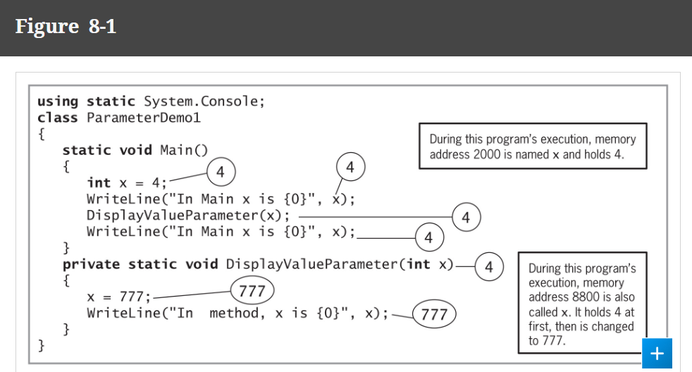

_Changing the value of x_ within the `DisplayValueParameter()` method has **no effect** on x in the `Main()` method. Even though both methods contain a variable named x, they **represent two separate variables**, each with its own memory location. 

Programmers say that a value parameter is used for “in” parameter passing—values for “in” parameters go into a method, but modifications to them do not come “out.” In the program in Figure 8-1, it makes no difference whether you use the name x as the Main() method’s actual parameter or use some other name. In either case, the parameter received by the DisplayValueParameter() method occupies a separate memory location. `Figure 8-2` shows the **output** of the program in Figure 8-1.

```
Figure 8-2
OUTPUT:

In Main x is 4
In method, x is 777
In Main x is 4
```

#### Two truths and a lie: C#'s Parameter Types

1. When you call a method that has a mandatory parameter, you must send in argument. `True`

2. When you call a method that has an optional parameter, you do not have to send an argument, but you can. `True`

3. When you call a method with a mandatory value parameter, you must pass an argument, but if it is variable, you do not have to have initialize it. `False`
> a mandatory value parameter **must** receive an initialized argument


## Passing Parameters by Reference

On occasion, you might want a method to be able to alter a value you pass to it. In that case, you can pass a **reference to a value**. When you use a `reference parameter`, `output parameter`, or `parameter array`, you pass a _memory address_ to a method, **allowing the method to alter** the original variable. 

Reference parameters, output parameters, and parameter arrays **differ** as follows:

- When you declare a `reference parameter` in a method header, the argument used to call the method **must have been assigned a value**.

- When you declare an `output parameter`, the argument used in the call **need not contain an original**, assigned value. However, an output parameter must be assigned a value _before the method ends_.

    My explanation of using output parameter

    > When you use an `out` parameter, the caller soes not need to assign it a value before sending the variable. But the method must assign a value to it before it finishes. This ensures that the method returns usable data directly into the caller's variable by referening its memory location, using `out`.

- When you declare a `parameter array`, the argument used in the call need not contain any original, assigned values, and the parameter array need not be assigned any values within the method.

Reference parameters, output parameters, and parameter arrays `do not occupy their own memory locations`. Rather, they act as **aliases**, or **pseudonyms** (other names), for the same memory location occupied by the values passed to them. You use the keyword `ref` as a modifier to indicate a reference parameter, the keyword `out` as a modifier to indicate an output parameter, and the keyword `params` to indicate a parameter array.


Using an alias for a variable is similar to using an alias for a person. Jane Doe might be known as “Ms. Doe” at work but “Sissy” at home. Both names refer to the same person.


## USing a ref Parameter

`Figure 8-3` shows a `Main()` method that calls a `DisplayReferenceParameter()` method. The `Main()` method **declares** and **initializes** a variable, **displays** its value, and then **passes** the variable to the method.

The modifier `ref` precedes both the variable name in the method call and the parameter declaration in the method header. 

The method's parameter `number` refers to the memory address of `x`, making `number` an `alias` for `x`. When `DisplayReferenceParameter()` changes th value of `number`, the change persists in the `x` variable within `Main()`.

`Figure 8-3`
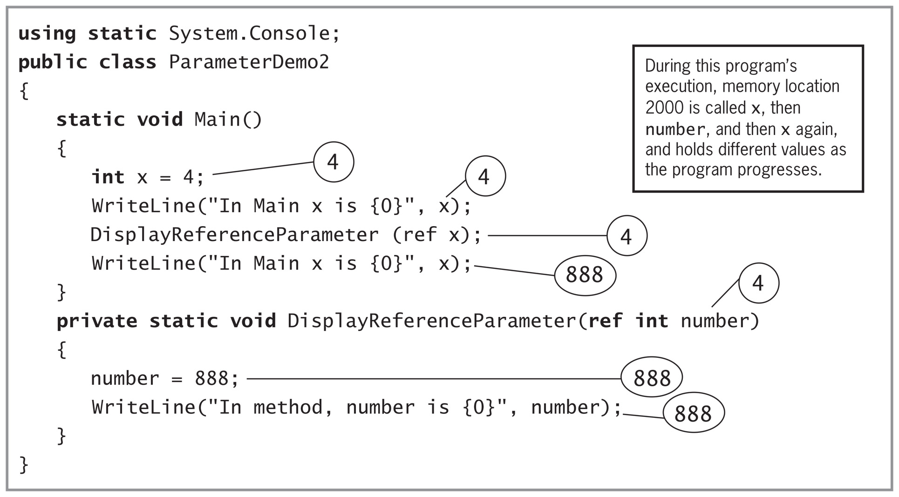

In the header of `DisplayReferenceParameter()` method, it makes no difference wheather you use the same name as the `Main()` method's passed variable (`x`) or some other name, such as number. 

In either case, the passsed and received variables occupy the same memory location--the address of one is the address of the other. 


## Using an `out` Parameter

When you use a refernce parameter, any passed variable must have an assigned value. 

Using an output parameter is `convenient when the passed variables does not have an assigned value yet`. For example, the program in `Figure 8-5` uses `InputMethod()to obtain values for 2 parameter. The arguments that are sent in the shaded statement get their values from the called method, so it makes sense to provide them with no values going in. 

Instead, they acquire values in the method and retain the values coming out. `Figure 8-6` shows a typical execution of the program.

`Figure 8-5`
)


## Using an `out` Variable

A new feature of C# 7.0 allows you to `declare a variable at the point where it is passed as an out argument`. The variable is known as an `out variable`. For example, in the InputMethodDemo program in `Figure 8-5`, you could remove the line with the declarations int first, second; and change the method call to the following:

```cs
InputMethod(out int first, out int second);
```

> The book is showing us that with the `out` parameters, you do not need to assign a value to the variable before calling the method--but you DO need to declare it. In newer versions, you can even declare the variable inline during the method call, making the code more concise while still allowing the method to assign the value before it ends. 


## Deciding Between `out` and `ref`

It might be helpful to remember:

- If you will always have an initial value, use `ref`.

- If you do not have an inital value or you do not know wheather you will have an inital value, use `out`. (For example, in an interactive program, a user might not provide a value for a variable, so you do not know wheather the variable has an inital value.)

In Summary, when you need a method to share a single value from a calling method, you have **2 options**:

1. `USE A RETURN TYPE:` you can send an argument to a method that **accepts** a _value parameter_, **alter** the local version of the variable within the method, **return** the altered value, and **assign** the return value to the original variable back in the calling method. The drawback to this approach is that a method can have only one single retutrn type and can return, at most, `one value`.

2. `Pass by reference`. You can send an argument to a method that accepts a **reference or output** parameter and alter the value at the original memory location within the method. A major *advantage* to using reference or output parameters exists when you want a method to `change multiple variables`.

     A method can have only a `single return type` and can return, at most, only one value, but by using **reference or output** parameters to a method, `you can change multiple values`. 
     
     However, a major `disadvantage` to using reference and output parameters is that they `allow multiple methods to have access to the same data`, **weakening** the “black box” paradigm that is so important to object-oriented methodology. 
     
     You should _never use ref or out parameters to avoid having to return a value_, but you should understand them so you can use them **if required.**


## Using a Built-in Method That Has an `out`

In `Chapter 2`, we learned 2 ways to convert a string to a number. You can use Conver class method or a `Parse()` method. For example, each of the following statement accepts a string and converts it to an integer named `score`:

```cs
int score = Convert.ToInt32(ReadLine());
int score = int.Parse(ReadLine());
```

With either of these statements, if the value accpeted by `ReadLine()` connot be converted to an integer (for example, because it contains a decimal point or an alphabetic char), the program abruptly stops running. Consider the simple program in `Figure 8-7`. The program prompts the user for a score and displays it. `Figure 8-8` shows 2 executions of the program.

`Figure 8-7`


In the first, the user enter a valid integer and everything goes smoothly. In the second one, the users enters alphabetic characters, the program stops, ans a series of error messages are displayed.

Figure 8-8: 
Two typical executions of the ConversionWithParse program
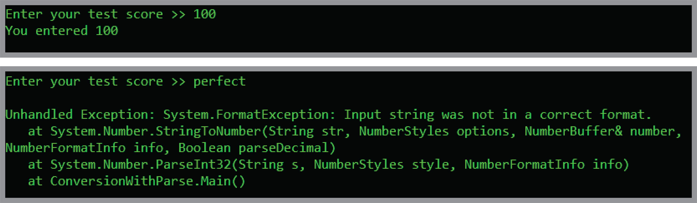

The messages in `Figure 8-8` indicate that the program contains an unhandled exception because Input string was not in a correct format. An exception is a program error; you will learn more in chpater 11.

For now, you can handle data conversions exceptions by the `TryParse()` method. Unlike the `Parse()` method, `TryParse()` accepts an `out` parameter. The `TryParse()` method converts a string to the correct data type and stores the result in a passed variable if possible. If conversion is not possible, the method assigns `0` to the variable.

> so instead of crashing, TryParse gracefully lets us know if conversion was not possible by setting the variable to 0.

`Figure 8-9` contains a program that uses the `int.TryParse()` method to convert `entryString` to an integer that is assigned to `score`.

Figure 8-9


The only difference from the program in 8-7 are that the shaded change to the class name and the shaded call to the `int.TryParse()` method. The TryParse() method accepts 2 parameter; the string to be converted and the variable where the result is stored. The keywword `out` is `required` with the secon parameter because the mothod receives its address and changes the value. `Figure 8-10` shows 2 typical executions of the ConvertWithTryParse program. The user's input connot be converted correctly, the `out` parameter is assigned `0`. Wheather or not the user's input is in the correct format, the program continues and displays output instead of error messsages. 

Figure 8-10


The TryParse() method requires the receiving variable to be an `out` parameter for 2 reasons:

1. The argument does not have an assigned value in the calling method.

2. The method returns a Boolean value that indicates whether the conversion was successful ans, so, it cannot return the `score` value too.

**key limitations of TryParse()**: Because a method can only return one value directly, it couldn't also be able to return the converted score through the return statement. 

### if I do not want 0 to be the default
Suppose that you do not want a score to be assigned 0 if the conversion fails, because 0 is a legeitimate score. Instead, you want to assign a -1 if the conversino fails. IN that case you can use a statement similar to the following:
```cs
if(!int.TryParse(entryString, out score))
    score = -1;
```

if entryString is not successful, `score` holds the converted value; otherwise, score holds -1.

As another example, you might consider code that includes a loop that continues until the entered value is in the correct format, such as the following:
```cs
Write("Enter your test score >> ");
entryString = ReadLine();
while(!int.TryParse(entryString, out score))
{
    WriteLIne("Input data was not formatted correctly");
    Write("Please enter score again >> ");
    entryString = ReadLine();
}
```

In this example the loop continues until the tryParse() method return true. Notice that we used the ! operateor on the while loop, meaning that the program will continuously check if the users enters the wrong format, if they do, the while loop becomes true and they get an elegant message.

C# also provides char.TryParse(), double.TryParse(), and ddecimall.TryParse() methods that work in the smae way. Each converts a first parameter string and assigns its value to the second parameter variable, returning true or false based on the si=uccess of the conversion. 


## Using Parameter Arrays

When you so not know how many arguments of the same data type might eventually be sent to a method, you can declare a `parameter array`--**a local array declared within the method header** using the keyword `params`. Such a method accepts any number of elements that are all the **same data type**.

For example, a method with the following header accepts an array of strings:

```cs
private static void DisplayStrings(params string[] people)
```

In the call to this method, you can use any number of strings as actual parameters; within the method, they will be treated as an array.

When a method header uses the `params` keyword, 2 **restrictions apply**:
1. Only one `params` keyword is permitted in a method heading.

2. If a method declares multiple parameters, the `params`-qualified parameter must be the last one in the list.

`Figure 8-11` show a program that calls DisplaySettings() 3 times--once with one string argument, once with 3 string arguments, and once with an array of strings. 

In each case, the method works correctly, treating the passed strings as an array and displaying them appropriately. Figure 8-12 shows the output.

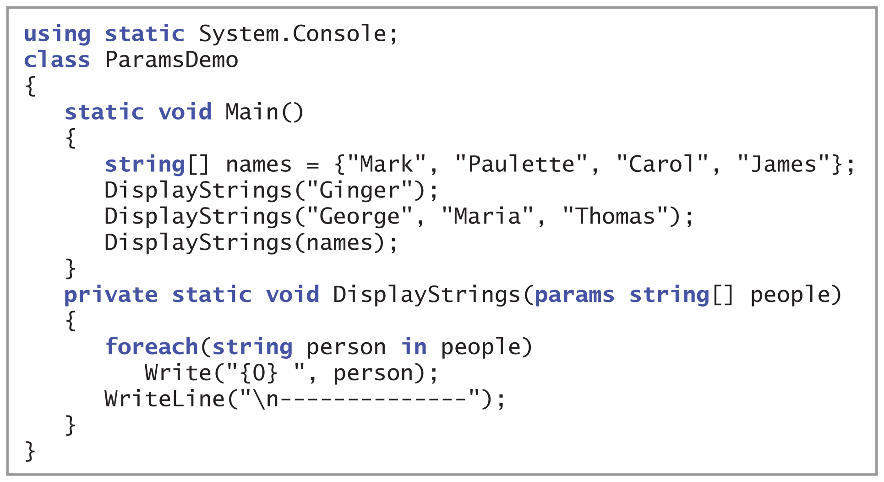
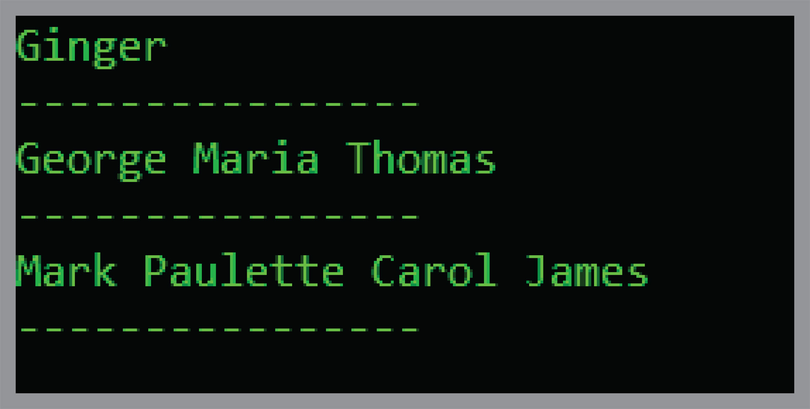


The `params` keyword tells the compiler, "This method can accept any number of string arguments."

Those arguments are automatically bundled into a string array named `people`.

You do not have to manually create an array--C# does it for you behind the scenes. 

So when we write:
```cs
DisplayStrings("Ginger");
DisplayStrings("George", "Maria", "Thomas");

```

C# internally treats it like: 
```cs
DisplayStrings(new string[] { "Ginger" });
DisplayStrings(new string[] { "George", "Maria", "Thomas" });

```

### More than just strings
You could create an even more flexible method by using a method header such as `Display(params Object[] things)`. Then then the passed parameters could be any type--**strings**, **integers**, **other classes**, and so on.

The method could be implemented as follows:
```cs
private static void Display(params Onject[] things)
    foreach(Object obj in things)
        Write("{0} ", obj);
    WriteLine("\n---------------");
```

All data types are `Objects`; you will learn more about the `object` class in the chapter: Using `Clases and Objects` and `Introduction to Inheritance`

### Two truths and a lie: Passing Parameter by Reference:

1. Both references and output parameters represent memory addresses that are passed to a method, allowing the method to alter the original variables. `T`

2. When you declare a reference parameter in a method header, the parameter must not have been assigned the value. `F`
> We need to clear a reference parameter in the method header. The parameter `must` have been assigned value.

3. When you use an output parameter, it need not contain an original assigned value when the method is called, but it must receive a value before the method ends. `T`

#### You DO IT:
```cs
using static System.Console;
class SwapProgram
{
    static void Main()
    {
        int first = 34, second = 712;
        Write("Before swap first is {0}", first);
        WriteLine(" and second is {0}", second);

        Swap(ref first, ref second);

        Write("After swap first is {0}", first);
        WriteLine(" and second is {0}", second);
    }

    private static void Swap(ref int one, ref int two)
    {
        int temp;
        temp = one;
        one = two;
        one = temp;
    }
}
```
You might want to use a method like `Swap()` as part of a larger program in which you verify, for example, that a higher value is displayed for a lower one: You would include the call to swap as part of a decision whose body executes only when the first value is less than a second one.
```cs
if(first < second)
{
    Swap(ref first, ref second);
}
```

## Returning a Reference from a Method

A new feature in C# 7.0 called `ref return` allows you to return a reference from a method. Using `ref` return has some RESSTRICTIONS; you can only return references that C# considers `safe to return`. 

For example, you can return a reference from a method if the `reference` was passed into the method, but `cannot if the value was passed `into the method. 

Consider the program in `Figure 8-14`.

It declares an array of 5 inventory item numbers and displays them. The program then prompts the user for an item to find and accepts it from the keyboard. IN the shaded statement, a reference name `soldItem` is declared and assigned the value returned from a method named `FindItem()`. 

Figure8-14
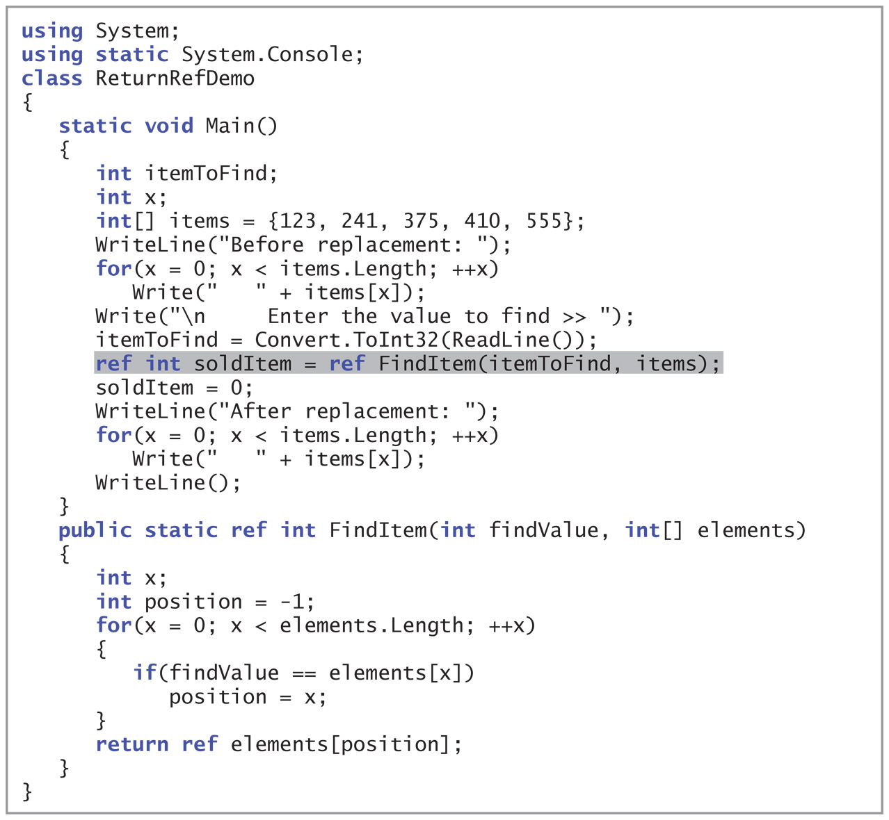

You can see in the shaded method call in Figure 8-14 that the FindItem() method accepts an integer to find in the array of valid item numbers. As you learned in Chapter 7, when an array is passed to a method, its address is received by the method.

The FindItem() method in Figure 8-14 uses a for loop to search the passed elements array for a match to the findValue parameter. When a match is found, the position is saved, and, in the return statement, the memory address of the found array element is returned. (Note that in this example, if the findValue parameter is not matched in the array, then the address of an invalid element that uses a negative subscript (−1) is returned from the method. You need to learn about exception handling in Chapter 11 before you can handle this mistake.)

In the Main() method, following the call to FindItem(), soldItem, which represents the memory address of the matching element, is set to 0 to indicate the item is no longer available. When the items array is displayed again, the correct element has been changed to 0. Figure 8-15 shows two separate executions of the program in which a different items element is removed each time.

`Figure 8-15`
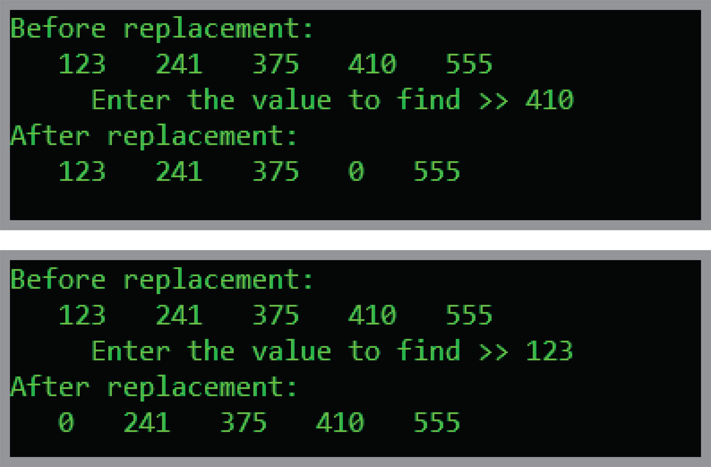

You could accomplish the removal of an item from the items array in the ReturnRefDemo program without returning a reference. For example, you could create the FindItem() method to return an integer subscript that is not a reference and then use it to access the desired element in the Main() method. So, for now, returning a reference from a method will be of limited value to you. However, you should understand that you can now return a reference in C#, and you might someday use the technique in a large program where it might be impractical to pass large amounts of data into and out of methods and much more practical to pass references.

1. A reference can be returned from any method `F`
> There are some restrictions on the uses of `ref` returns. For example, you can return a reference from a method if the reference was passed into the method, but cannot if the value was passed into the method.

3. When a method return a refernce, it cannot also return a value. `T`


## Overloading Methods

**Overloading** involves the ability to write multiple version of a  method using the same mathos name. When you make a purchase at a store, you might use one of a variety of "pay" methods they accept, for example, cash, a credit card, or a check. The "pay" method works differently depending on the type of currency sent to it, but all of the transactions are called "pay". When you overload a C# method, you write multiple method implementaions with the same name but different paramater list. A method's name and parameter list consitute the methods's **signature**. 

In this book, you have seen the `WriteLine()` method used with a _string_ parameter and a _numeric_ parameter. You can use it with no parameter to output a blank line. You also have seen the method of use with several parameters when you have used a _format string_ along with several _variables_. Therefore, you know WriteLine() is an `overloaded` method.

Some C# operators are overloaded. For example, a `+` between two numeric values indicate addition, but a single `+` to the left of a value means the value is positive. The `+` sign has different meaning based on the operands used with it. In the chapter `Using Classes and Objects`, you will learn how to overload operators to make them mean what you want with your own classes.

The compiler understands which method to use based on the arguments you use in a method call. For example, suppose that you create a method to display a `string` surrounded by a border. The method receives a `string` and uses the `string Length` property to determine **how many asterisks to use to construct a border around the string**. Figure 8-16 shows a program that contains the method.

`Figure 8-16`
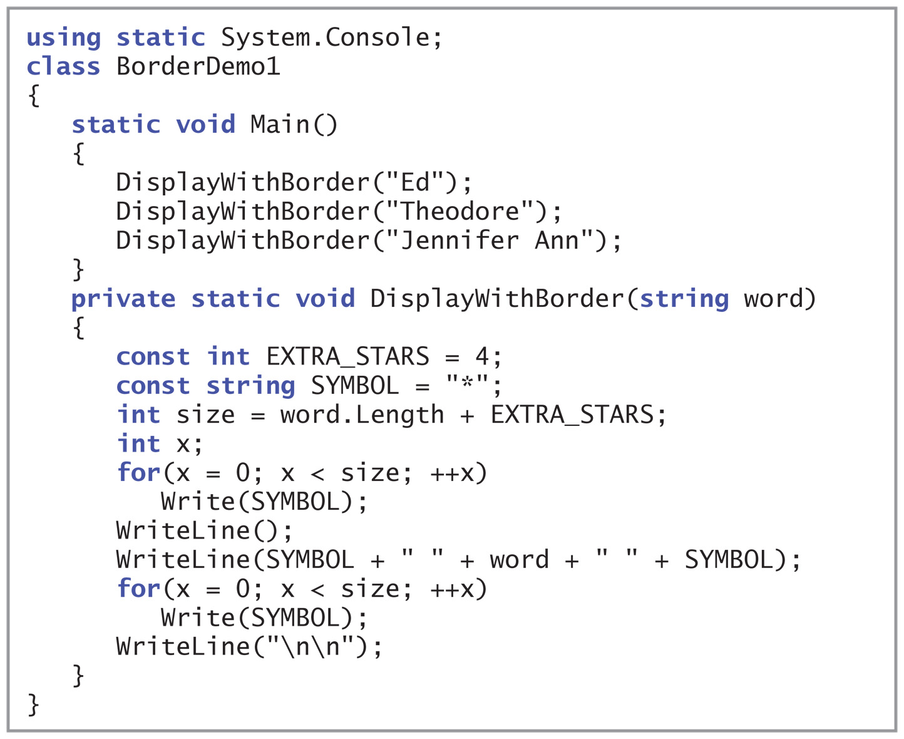

When the `Main()` method calls the `DisplayWithBorder()` method in the program in `Figure 8-16` and passes a string value, the method calculates a size as the length of the string plus 4, and then draws that many symbols on a single line. The method then displays a symbol, a space, the string, another space, and another symbol on the next line. Figure 8-17 shows the output.

`Figure 8-17`
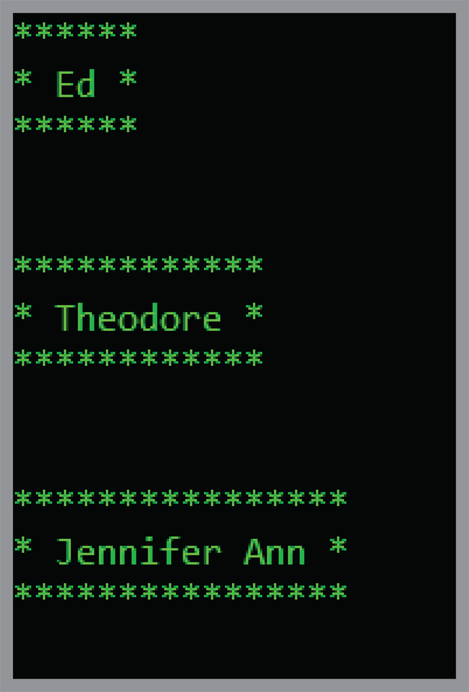

Suppose that you are so pleased with the output of the `DisplayWithBorder()` method that you want to use something similar to displlay your company's weekly sales goal figure. The problem is that the weekly sales goal amount is stored as an integer, and so it cannot be passed the existing method. You can take one of several approaches:

- You can convert the integer sales goal to a ` string` and use the existing method. This is an acceptable approach, but it requires that you remember to write an extra step in any program in which you display an integer using the border. 

- You can create a new method with a unique name such as `DisplayWithBorderusingInt()` and use it to accept an integer parameter. The drawback to this approach is that you must remember method names when you use different data types.

- you can overload the `DisplayWithBorder()` method. Overloaded method involves `wrtitting multiple methods with the same name but with different parameter types`. For example, in addition to the `DisplayWithBorder()` method shown in `Figure 8-16`, you could use the method shown in `Figure 8-18`

`Figure 8-18`
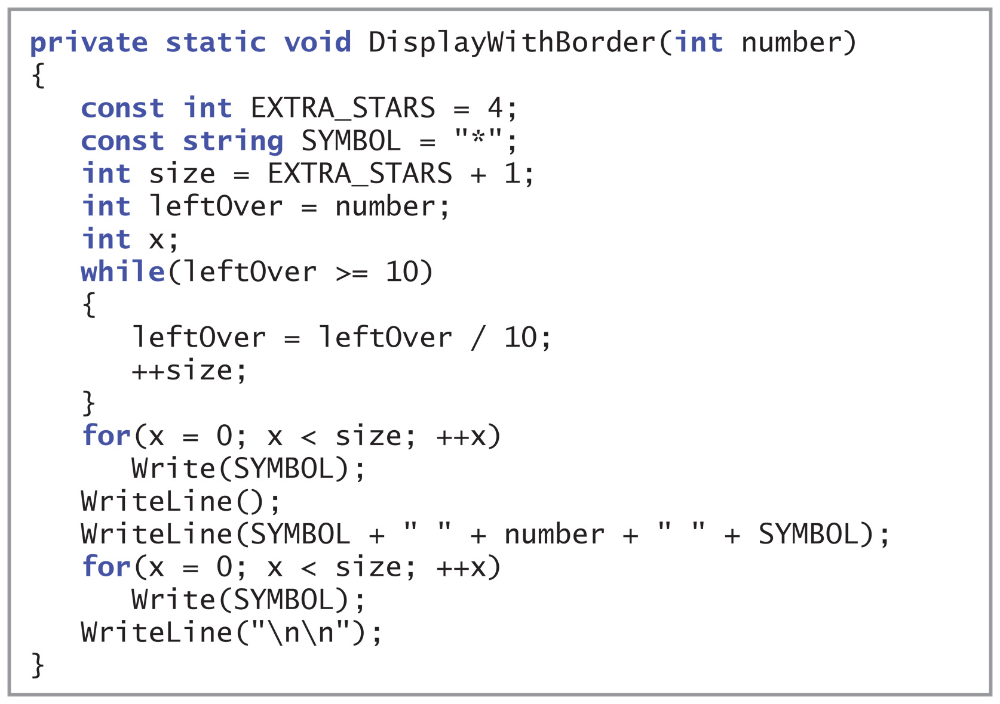

In the version of the `DisplayWithBorder()` method in `Figure 8-18`, the parameter is an int. To determine how many asterisks to display, the method initializes size to the number of extra stars in the display (in this case 4), plus one more. 

It then `determines the number of asterisks to display` in the border by repeatedly dividing the parameter by 10 and adding the result to size. For example, when the argument to the method is 456, leftOver is initialized to 456. Because it is at least 10, it is divided by 10, giving 45, and size is increased from 5 to 6. Then 45 is divided by 10, giving 4, and size is increased to 7. Because 4 is not at least 10, the loop ends, and the program has determined that the top and bottom borders of the box surrounding 456 require seven stars each. The rest of the method executes like the original version that accepts a string parameter.


The DisplayWithBorder() method **does not quite work correctly** if a `negative integer` is passed to it because the negative sign occupies an additional display space. To rectify the problem, you could modify the method to `add an extra symbol to the border when a negative argument is passed in`, or you could force all negative numbers to be their positive equivalent.

If both versions of `DisplayWithBorder()` are included in a program and you call the method using a string, as in DisplayWithBorder("Ed"), the first version of the method shown in `Figure 8-16`executes. If you use an integer as the argument in the call to `DisplayWithBorder()`, as in `DisplayWithBorder(456)`, then the method shown in `Figure 8-18` executes. `Figure 8-19` shows a program that demonstrates several method calls, and `Figure 8-20` shows the output.

Figure 8-19
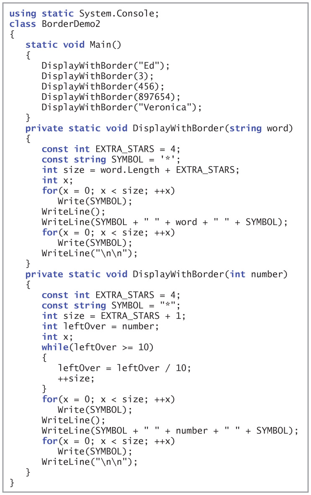
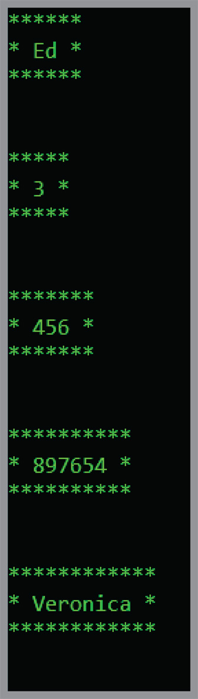

Methods are overloaded correctly when they have the same identifier but their parameter lists are different. Parameter lists differ when the number and order of types within the lists are unique. For example, you could write several methods with the same identifier, and one method could accept an int, another two ints, and another three ints. A fourth method could accept an int followed by a double, and another could accept a double followed by an int. Yet another version could accept no parameters. The parameter identifiers in overloaded methods do not matter, nor do the return types of the methods. The only two requirements to overload methods are the same identifier and different parameter lists.

Instead of overloading methods, you can choose to use methods with different names to accept the diverse data types, and you can place a decision within your program to determine which version of the method to call. However, it is more convenient to use one method name and then let the compiler determine which method to use. Overloading a method also makes it more convenient for other programmers to use your method in the future. Usually you do not create overloaded methods so that a single program can use all the versions. More often, you create overloaded methods so different programs can use the version most appropriate to the task at hand. Frequently, you create overloaded methods in your classes not because you need them immediately, but because you know client programs might need multiple versions in the future, and it is easier for programmers to remember one reasonable name for tasks that are functionally identical except for parameter types.


## Understanding Overloaded Resolution

When the method call could execute multiple overloaded method versions, C# determines which method to execute using a process called `overload resolution`. For example, suppose that you create a method with the following declarations:
```cs
private static void MyMethod(double d)
```

You can call this method using a double argument, as in the following:
```cs
MyMethod(2.50)
```

You can also call this method using a `int` argument, as in the following:
```cs
MyMethod(4);
```

The call that uses the `int` argument worked because an int can automaically be promoted to a double. In `Chapter 2, you learn that when an int is promoted to a double, the process is called _implicit_ conversion or _implicit cast_.

Suppose that you create overloaded methods with the following declarations:

```cs
private static void MyMethod(double d)
private static void MyMethod(int i)
```

If you can call `MyMethod()` using an integer argument, both methods are `applicable methods`. That means either method on its own could accept a call that uses an `int`. 

However, if both methods exists in the same class (making them overload), the second version will execute because it is a better match for the method call. The rules that determine which version to call are known as `betterness rules`.

Betterness rules are similar to the implicit conversion rules you learned in Chapter 2. For example, although an `int` could be accepted by a method that accepts an `int`, a `float`, or a `double`, an int is the best match. If no version with an `int` parameter exists, then a `float` is a better match than a `double`. `Table 8-1` shows the betterness rules for several types.

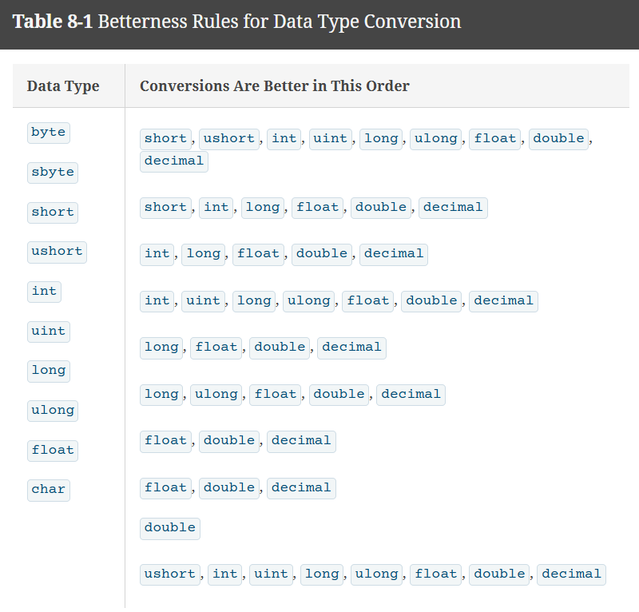


## Discovering Built-In Overloaded Methods

When you use the IDE to create programs, Visual Studio’s IntelliSense features provide **information** about methods you are using. For example,` Figure 8-21` shows the IDE just after the programmer has typed the opening parenthesis to the Convert.ToInt32() method. Notice the drop-down list that indicates Convert.ToInt32(bool value) is just 1 of 19 overloaded versions of the method. You can click the nodes to scroll through the rest of the list and see that other versions accept bool, byte, char, and so on. When retrieving an entry from a TextBox on a Form, your intention is to use the Convert.ToInt32(string value) version of the method, but many overloaded versions are available for your convenience. C# could have included multiple methods with different names such as ConvertBool.ToInt32() and ConvertString.ToInt32(), but having a single method with the name Convert.ToInt32() that takes many different argument types makes it easier for you to remember the method name and to use it. As you work with the IDE, you will examine many such methods.

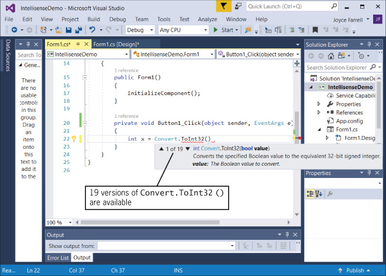`


```cs
// You do it

using static System.Console
class OverloadedTriples
{
    // overloaded method tha triples an integer

    private static void Triple(int num)
    {
        const int MULT_FACTOR = 3;
        WriteLine("{0} times {1} is {2}\n", num, MULT_FACTOR, num * MULT_FACTOR);
    }

    private static void Triple(string message)
    {
        WriteLine("{0}\t{0}\t{0}\n", message);
    }

    static void main()
    {
        int num = 20;
        string messaage = "Go team!";

        Triple(num);
        Triple(message);
    }    
}
```


## Avoiding Ambiguous Methods

When you overload a method, you run the risk of creating ambiguous methods. A situation in which the compiler cannot determine which method to use. Every time you call a method, the compiler decides whether a suitable method exists. If so, the method executes, and if not, you receive an error message.

For example, suppose that you write two versions of a simple method, as in the program in `Figure 8-23`. The class contains two versions of a method named `SimpleMethod()`--one that takes a `double` and an `int`, and one that takes an `int` and a `double`.

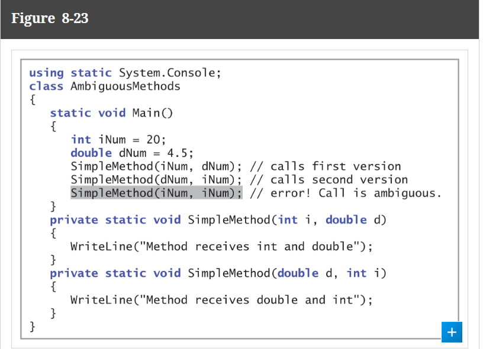

In the `Main()` method in `Figure 8-23`, a call to `SimpleMethod()` with an integer argument **first** and a `double` argument **second** executes the first version of the method, and a call to `SimpleMethod()` with a `double` **first** and an integer argument **second** executes the second version of the method. 

With each of these calls, the compiler can find an exact match for the arguments you send. However, if you call `SimpleMethod()` using **two integer arguments**, as in the shaded statement, an ambiguous situations arises because there is no exact match for the method call. Because the first integer could be promoted to a double (Matching the second version of the overloaded method), or the second integer could be promoted to a `double`(matching the first version), the compiler does not know which version of `SimpleMethod()` to use, and the program will not compile or execute. In Figure 8-24 shows the error message that is generated. 

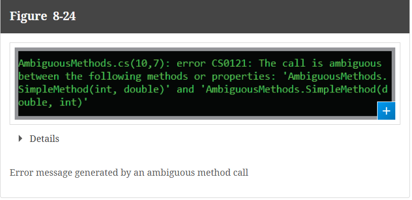


An overloaded method is not ambiguous on its own. It becomes ambiguous only if you create an ambiguous situation. A program with potentially ambiguous methods will run without problems if you make no ambiguous method calls. For example, if you remove the shaded statement in Figure 8 - 23 that calls `SimpleMethod()` using two integer arguments, the program compiles and executes.

If you remove one of the versions of simple method from the program, then the method call that uses `2 integer arguments would work because one of the integers would be promoted to a doubl`e. However, then one of the other methods calls would fail.

---
Methods can be overloaded correctly by providing different parameter lists for methods with the same name. Methods with identical names that have identical parameter list but different return types are not overloaded. They are illegal. For example, the following two methods cannot coexist within the class:

```cs
private static int AMethod(int x)
private static void AMethod(int x)
```

The compiler determines which of several versions of a method to call based on parameter list. When the method call is made, the compiler will not know which method to execute because both possibilities take an integer argument. Similarly, the following method could not coexist with either the previous versions:

```cs
private static void AMethod(int someNnumber)
```

### renaming the local identifier for the parameter
Even though this method uses a different local identifier for the parameter, its parameter lists a single integer is still the same to the compiler. 


## Using Optional parameter

Sometimes it is useful to create a method that allows **one or more arguments to be omitted** from the method call. An optional parameter is not required; if you `don’t send a value` as an argument, a **default** value is automatically supplied.

### how?

You make a parameter optional by providing a value for it in the method declaration. Only value parameters can be given default values; those that use `ref, out, and params cannot have default values`. Any optional parameters in a parameter list `must` appear to the **right** of the mandatory parameters.

For example, suppose that you write a method that calculates either the area of a square or the volume of a cube, depending on whether two or three arguments are sent to it. `Figure 8-25` shows such a method; notice the shaded default value provided for the third parameter. 

When you want a cube’s volume, you can pass three arguments to the method: length, width, and height. When you want a square’s area, you pass only two parameters, and a default value of 1 is used for the height. In this example, the height is a default parameter and is optional; the `length and width, which are not provided with default values, are mandatory parameters`. That is, at least two arguments must be sent to the `DisplaySize()` method, but three can be sent. In the program in `Figure 8-25`, calling `DisplaySize(4, 6)` has the same effect as calling `DisplaySize(4, 6, 1)`. Figure 8-26 shows the execution of the **OptionalParameterDemo** program.

Figure 8-25
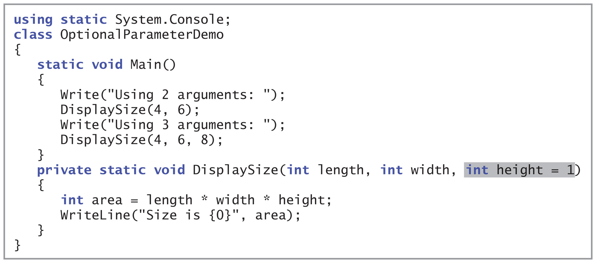
Figure 8-26
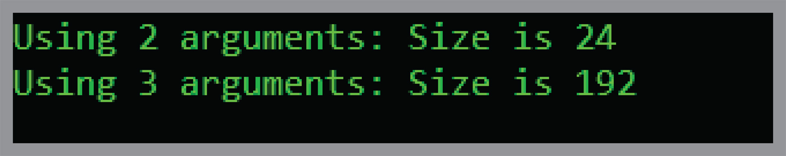

**If you assign a default value** to any variable in a method’s parameter list, then all parameters to the right of that parameter `must` also have `default values`. `Table 8-2` shows some examples of valid and invalid method declarations.

### Table 8-2  Examples of Valid and Invalid Optional Parameter Method Declarations

| **Method Declaration** | **Explanation** |
|-------------------------|-----------------|
| `private static void M1(int a, int b, int c, int d = 10)` | ✅ Valid. The first three parameters are mandatory and the last one is optional. |
| `private static void M2(int a, int b = 3, int c)` | ❌ Invalid. Because `b` has a default value, `c` must also have one. |
| `private static void M3(int a = 3, int b = 4, int c = 5)` | ✅ Valid. All parameters are optional. |
| `private static void M4(int a, int b, int c)` | ✅ Valid. All parameters are mandatory. |
| `private static void M5(int a = 4, int b, int c = 8)` | ❌ Invalid. Because `a` has a default value, both `b` and `c` must have default values. |

When you call a method that contains default parameters, you can always choose to provide a value for every parameter. However, if you omit an argument when you call a method that has default parameters, then you must do one of the following:

1. You must leave out all unnamed arguments to the right of the last argument you use.

2. You can name arguments.

> When calling a method with default parameters, you can choose to omit the arguments, but only from right to left. If you want to escape a parameter in the middle, you must use named arguments to tell the complier exactly which value goes where.
```cs
count: 5
```


## Leaving Out Unnamed Arguments

When calling a method with optional parameters and using unnamed arguments, you must leave out any arguments to the right of the last one used. In other words, once an argument is left out, you must leave out all the arguments that would otherwise follow.

This means:

- If you use unnamed arguments, you must fill them in order

- Once you skip one, you can’t go back and fill a later one without naming it
```cs
void Show(string message = "Hello", int count = 3)

Show("Hi", 5);        // ✅ Unnamed arguments
Show("Hi");           // ✅ Uses default for count
Show();               // ✅ Uses both defaults
```

```cs
Configure(a: 1, c: 3); // ✅ Named arguments let you skip b

```

For example, assume you have declared a method as follows:
```cs
private static void Method1(int a, char b, int = 22, double d = 33.2)
```

Table 8-3: Legal and illegal calls to this method:
### Table 8-3  Examples of Legal and Illegal Calls to `Method1()`

| **Call to `Method1()`** | **Explanation** |
|--------------------------|-----------------|
| `Method1(1, 'A', 3, 4.4);` | ✅ Valid. The four arguments are assigned to the four parameters. |
| `Method1(1, 'K', 9);` | ✅ Valid. The three arguments are assigned to `a`, `b`, and `c` in the method, and the default value of `33.2` is used for `d`. |
| `Method1(5, 'D');` | ✅ Valid. The two arguments are assigned to `a` and `b` in the method, and the default values of `22` and `33.2` are used for `c` and `d`, respectively. |
| `Method1(1);` | ❌ Invalid. `Method1()` requires at least two arguments for the first two parameters. |
| `Method1();` | ❌ Invalid. `Method1()` requires at least two arguments for the first two parameters. |
| `Method1(3, 18.5);` | ❌ Invalid. The first argument, `3`, can be assigned to `a`, but the second argument must be type `char`. |
| `Method1(4, 'R', 55.5);` | ❌ Invalid. The first argument, `4`, can be assigned to `a`, and the second argument, `'R'`, can be assigned to `b`, but the third argument must be type `int`. When arguments are unnamed, you cannot “skip” parameter `c`, use its default value, and assign `55.5` to parameter `d`. |


## Using Named Arguments

You can leave out optional arguments in a method call if you pass the remaining arguments by name. A `named argument` is a method argument that` is preceded with the name of the called method’s parameter to which it will be assigned. `Named arguments can appear in **any order**, but they must appear **after all the unnamed arguments** have been listed. Each unnamed argument is also known as a *positional argument*. You name an argument using its parameter name and a colon before the value.


In Chapter 7, you learned that if you use the IntelliSense feature of Visual Studio, you can discover a method’s parameter names. See Appendix C for more details.

For example, assume you have declared a method as follows:
```cs
private static void Method2(int a, char b, int = 22, double d = 33.2)
```

### Table 8-4  Examples of Legal and Illegal Calls to `Method2()`

| **Call to `Method2()`** | **Explanation** |
|--------------------------|-----------------|
| `Method2(1, 'A');` | ✅ Valid. The two arguments are assigned to `a` and `b` in the method, and the default values of `22` and `33.2` are used for `c` and `d`, respectively. |
| `Method2(2, 'E', 3);` | ✅ Valid. The three arguments are assigned to `a`, `b`, and `c`. The default value `33.2` is used for `d`. |
| `Method2(2, 'E', c : 3);` | ✅ Valid. This call is identical to the one above. |
| `Method2(1, 'K', d : 88.8);` | ✅ Valid. The first two arguments are assigned to `a` and `b`. The default value `22` is used for `c`. The named value `88.8` is used for `d`. |
| `Method2(d : 2.1, b : 'A', c : 88, a: 12);` | ✅ Valid. All the arguments are assigned to parameters whether they are listed in order or not. |
| `Method2(5, 'S', d : 7.4, c: 9);` | ✅ Valid. The first two arguments are assigned to `a` and `b`. Even though the values for `c` and `d` are not listed in order, they are assigned correctly. |
| `Method2(d : 11.1, 6, 'P');` | ❌ Invalid. This call contains an unnamed argument after the first named argument. Named arguments must appear after all unnamed arguments. |


## Advantages to Using Named Argumentss

Optional parameters can provide a convenient shortcut to writing multiple **overloaded** versions of a method. For example, suppose that you want to create a method that adds your signature to business letters. Usually, you want the signature to be Sincerely, James O’Hara. However, occasionally you want to change the name to a more casual Jim. You could write two method versions, as shown on the top in `Figure 8-27`, or you could write one version, as shown on the bottom. With both versions, you can call `Closing()` with or without an argument. The version with the optional parameter is less work when you write the method. It is also less work if you later want to modify the method—for example, to change _Sincerely_ to **Best wishes** or some other closing.

Figure 8-27
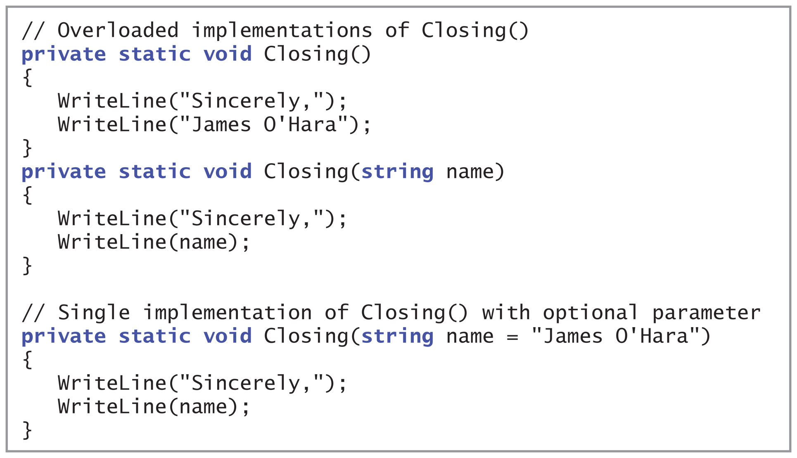

**Another Advantage** To using name parameters is to make your programs more self documenting. Programs that are self documenting provide a built-in explanations that make the code clearer to readers and therefore easier for others to modify in the future. For example, suppose that you encountered the following method call:
```cs

`DisplayEmployeeData(empNumber, true);
```
From the method call it is not clear what true means. Perhaps it means that only certain parts of the record should be displayed, or that the employee is A current employee, or that the employee salary should be hidden from you. The following method call makes your intentions clearer
```cs
SiplayEmployeeData(empNumber, shouldHideSalary : true);
```

Of course, a program comment adjacent to the statement could also provide clarity.


## Disadvantages to Using Named Arguments

A major `disadvantage` to using named arguments is that `the calling method becomes linked to details within the method`. When the calling method must know parameter names within the called method, an important principle of programming—method implementation hiding—is compromised. If the parameter name in the called method is changed in the future, the client method also will have to change.

Suppose that a payroll program contains two methods used in paycheck calculations. The first method, shown in Figure 8-28, accepts three parameters—hours, rate, and bonus. A gross pay value is calculated by multiplying hours by rate, and a bonus value is assigned based on the number of hours worked. The second method sums its gross and bonus parameters. The intention is that an employee who works 40 hours at $10 per hour receives $400 gross pay, plus a $100 bonus, for a total of $500.

Figure 8-28
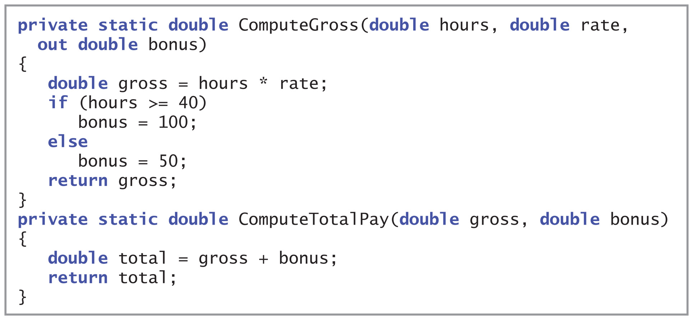

Figure 8-29 shows the Main() method of a program that assigns 40 to hours and 10.00 to rate. Then, the method calls the ComputeTotalPay() method by passing it the result of ComputeGross() and the value of bonus that is set within ComputeGross(). Figure 8-30 shows that the employee’s total pay is correctly calculated as $500.

Figure 8-29

Figure 8-30


A possible disadvantage to using named arguments occurs when a named parameter value is an expression instead of a constant. Figure 8-31 shows a Main() method that calls ComputeTotalPay() using named arguments. The only difference from the program in Figure 8-29 is the shaded method call that uses named arguments. In this case, when ComputeTotalPay() is called, first 0 is sent to bonus, and then ComputeGross() is called to assign a value to gross. However, the bonus alteration in ComputeGross() is too late because bonus has already been assigned. The program output is incorrect, as shown in Figure 8-32.

Figure 8-31
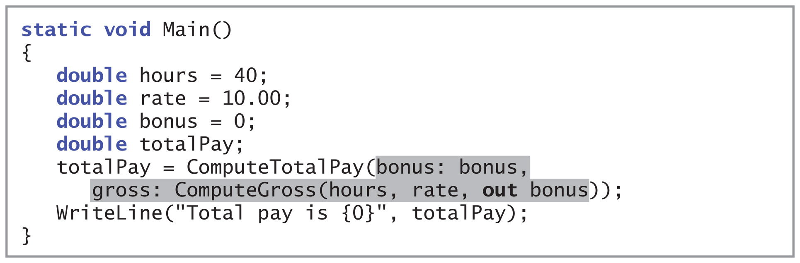
Figure 8-32


In `Chapter 4`, you learned that when you combine operands in a Boolean expression using && or ||, you risk side effects because of short-circuit evaluation. The situation with named arguments is similar. `When a named argument is an expression, there can be unintended consequences.`


## Overload Resolution with Named and Optional Arguments

Named and optional arguments affect overload resolution. The rules for betterness on argument conversions are applied only for arguments that are given explicitly; in other words, omitted optional arguments are ignored for betterness purposes. For example, suppose that you have the following methods:

```cs
private static void AMethod(int a, double b = 2.2)
private static void AMethod(int a, char b = 2.2)
```

Both are applicable methods when a call is made using an integer argument; in other words, if either method existed alone, the call AMethod(12) would work. When the two methods coexist, however, neither is “better.” Because C# cannot determine which one is better, the code will not compile.

If two signatures are equally good, the one that does not omit optional parameters is considered better. For example, suppose that you have two methods as follows:

```cs
private static void BMethod(int a)
private static void BMethod(int a, char b = 'B')
```

If either method existed alone, the call BMethod(12) would work, but when the two coexist, the first version is better because no optional parameters are omitted in the call.